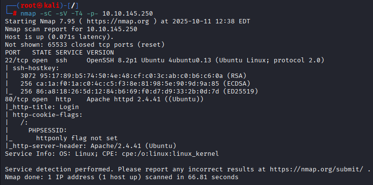
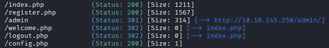
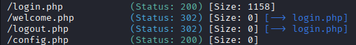
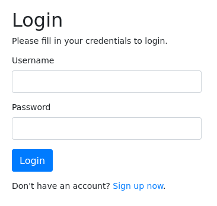
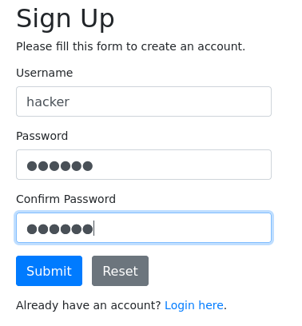
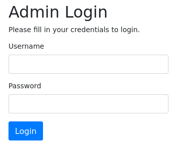

---

title: "Napping"

---
<center>
<strong>1. 🔍 Enumeration Part + Directory Bruteforcing</strong><br> 
<strong>2. ☠️ Exploitation Part</strong><br>
<strong>3. 🔓 Privilege Escalation Part</strong>
</center>

---

<span style="color:red"><strong>1. 🔍 Enumeration Part + Directory Bruteforcing</strong></span><br>
We will start from the nmap scan:
<center>
 
</center><br>

Directory bruteforcing using gobuster tool:<br>
```bash
gobuster dir -u http://10.10.136.217/ -w=/usr/share/wordlists/dirbuster/directory-list-lowercase-2.3-medium.txt -x php
```
<center>

</center><br>

We also see that /admin directory appeared, going further to see more:<br>
```bash
gobuster dir -u http://10.10.136.217/admin/ -w=/usr/share/wordlists/dirbuster/directory-list-lowercase-2.3-medium.txt -x php
```

<center>
 
</center>

Cheking the main page:<br>
<center>

</center>

We will sign up a new account<br>
<center>

</center><br>

Also checking the admin page on /admin/login.php<br>
<center>

</center>

After creating and signing up we see the text that says "Please submit your link so that we can get started.
All links will be reviewed by our admin who also built this site!"<br>
<center>

</center>
<br>

Guessing that if we will do a mirroring of login.php page the admin will review it and enter his creds, lets try:<br>
<span style="color:red"><strong>2. ☠️ Exploitation Part</strong></span><br>

